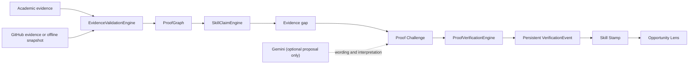

# SkillPassport

**A resume is a claim. SkillPassport shows the evidence — and lets you challenge it.**

SkillPassport turns academic records and real project work into inspectable skill claims. It shows why a claim exists, identifies what the evidence does not yet prove, and lets a candidate close that gap with a deterministic Proof Challenge. The resulting proof can then be compared with an opportunity and shared as a public, read-only SkillPassport.

The first product wedge is student and early-career technical talent moving between Japan and India, including the Waseda–VTU hackathon context. The longer-term idea is portable capability evidence across institutions and employers—not another resume generator, generic job board, or AI-issued certificate.

## Product loop

```text
Real evidence → ProofGraph → Skill claim → Evidence gap
              → Proof Challenge → VerificationEvent
              → Skill Stamp → Opportunity Lens
```

The demo tells the same story in five words:

> **Claim → Doubt → Challenge → Proof → Opportunity**

### ProofGraph

ProofGraph makes every skill claim inspectable. A claim can point to source files, dependency manifests, tests, candidate-attributed commits, coursework, and prior verification events. Academic records are supporting evidence and bundled academic records are explicitly labeled as demo data.

### Proof Challenge

Proof Lab challenges the uncertainty found in the candidate's evidence. A short targeted concept check provides context; a constrained coding, debugging, validation, or SQL task is the primary proof. Deterministic tests—not an LLM response—decide whether the task passed.

### Opportunity Lens

Opportunity Lens compares an English, Japanese, or mixed-language opportunity with the passport. It keeps challenge-verified, evidence-backed, detected, and missing requirements separate. Where a supported proof task exists, **Prove this skill** closes the loop back to Proof Lab.

## Core principle

> **AI proposes. Engines prove.**

Gemini may interpret an evidence gap, personalize challenge wording, or turn an opportunity description into structured requirements. It cannot mark a test as passed, create a verified skill by itself, or override deterministic verification. Without a Gemini key, deterministic templates and taxonomy matching keep the complete demo usable.

## Trust model

SkillPassport deliberately avoids opaque confidence percentages. A skill claim moves through explicit states:

| State | Meaning | What it does not mean |
|---|---|---|
| `DETECTED` | At least one relevant signal exists. | The candidate has proved mastery. |
| `EVIDENCE_BACKED` | Multiple inspectable signals support the claim. | The code was execution-verified. |
| `CHALLENGE_VERIFIED` | A relevant Proof Challenge passed deterministic tests. | Identity, authorship, or global accreditation is guaranteed. |

Only the proof-verification engine may promote a claim to `CHALLENGE_VERIFIED`. A passing result creates a persistent `VerificationEvent`; a Skill Stamp is derived from that event. Refreshing the browser is never the source of truth.

## Architecture

The FastAPI application serves the frontend and API from one process. The core trust path is deterministic:



Live GitHub ingestion is optional and bounded. A bundled repository snapshot keeps the judge flow deterministic without network access. Persistence uses a local file-backed store by default and may use MongoDB when configured through the same store abstraction. Public passport verification exposes a read-only view and integrity reference; the hash is tamper-evident metadata, not a digital signature or accreditation.

See [Architecture](docs/architecture.md) for data flows, trust boundaries, fallbacks, and model responsibilities.

## Technology

- FastAPI and Pydantic for the web API and validated data contracts
- HTML, CSS, and JavaScript for the product interface
- Deterministic evidence rules and challenge verification
- Local file persistence by default; optional MongoDB adapter
- Bounded GitHub API ingestion with an offline snapshot fallback
- Optional Google Gemini structured interpretation with deterministic fallback
- SHA-256 event integrity references and a public verification view

The runtime dependency list is authoritative. Legacy experimental classifiers, if retained for historical context, are not part of the live verification path.

## Run locally

From the repository root:

```bash
python -m venv .venv
source .venv/bin/activate
python -m pip install -r backend/requirements.txt
uvicorn backend.main:app --reload
```

Open [http://127.0.0.1:8000](http://127.0.0.1:8000). No external credential is required for the bundled Judge Demo.

Windows PowerShell activation:

```powershell
.venv\Scripts\Activate.ps1
```

## Deploy

The checked-in production configuration supports a Render FastAPI backend and a
Netlify static frontend. Deploy Render first, give Netlify the resulting public
`/api` URL, then allow the exact Netlify origin through Render's `FRONTEND_URL`.
The browser bundle contains public URLs only; provider and database credentials
remain on Render.

See [Deployment](DEPLOYMENT.md) for the exact Blueprint/import steps, environment
variables, CORS setup, validation checklist, persistence warning, and
troubleshooting. A Render JSON-file fallback is suitable for a disposable demo but
is not durable across service restarts or redeploys; use MongoDB and confirm
`durable_mongodb` at `/api/health` when verification history must persist.

## Optional environment variables

Copy `.env.example` to `.env` only when enabling a local integration. Render uses
the same backend variable names:

| Variable | Purpose | Required for Judge Demo? |
|---|---|---|
| `FRONTEND_URL` | Allows one or more exact, comma/semicolon-separated frontend origins through CORS. Empty is correct for local same-origin use. | No |
| `PORT` | Selects the local listening port. Render supplies this automatically. | No |
| `GITHUB_TOKEN` | Raises GitHub API limits and enables repositories the token can read. | No |
| `GEMINI_API_KEY` | Enables structured challenge and opportunity interpretation. | No |
| `GEMINI_MODEL` | Selects the configured Gemini model. | No |
| `MONGODB_URI` | Selects durable MongoDB instead of the JSON-file fallback. | No locally; recommended on Render |
| `MONGODB_DATABASE` | Selects the MongoDB database name when MongoDB is enabled. | No |
| `SKILLPASSPORT_STORE_PATH` | Overrides the local file-store path. | No |
| `CHALLENGE_TIMEOUT_SECONDS` | Sets the bounded challenge timeout accepted by the backend. | No |
| `PUBLIC_BASE_URL` | Fixes backend-generated QR targets to the frontend origin. | No locally; recommended for split hosting |

Netlify's build receives public configuration only:

| Variable | Purpose | Required for Render + Netlify? |
|---|---|---|
| `SKILLPASSPORT_API_BASE_URL` | Absolute Render API prefix, such as `https://service.onrender.com/api`. | Yes |
| `PUBLIC_APP_BASE_URL` | Final public frontend origin for sharing and social metadata. Netlify's deployment URL is the fallback. | No |
| `VITE_API_BASE_URL` | Compatibility fallback for the API prefix. Prefer `SKILLPASSPORT_API_BASE_URL`. | No |

Never commit `.env` or credentials. Public repositories should still degrade gracefully when GitHub is unavailable or rate-limited.

## Judge Demo

The stable path is designed to work without GitHub, Gemini, or MongoDB:

1. Open the landing page and choose **View Judge Demo**.
2. Choose **Analyze Evidence** and open a FastAPI claim with **View Proof**.
3. Point out the source paths, tests, contribution signal, supporting demo coursework, and remaining uncertainty.
4. Choose **Challenge this skill**, complete the targeted check, and submit the bundled proof task.
5. Show the deterministic tests and the transition from `EVIDENCE_BACKED` to `CHALLENGE_VERIFIED`.
6. Open **Opportunity Lens** and compare the updated passport with the Tokyo backend opportunity.
7. Follow **Prove this skill** for an unproven supported requirement, or continue to **SkillPassport**.
8. Open the public verification view from the stamp or QR/share action.

Use [Demo Script](docs/DEMO_SCRIPT.md) for the timed 90-second and 3-minute versions. Use [Judge Guide](docs/JUDGE_GUIDE.md) for rubric mapping and technical Q&A.

## Verification and quality checks

Run from the repository root:

```bash
pytest -q
python -m compileall backend
```

If frontend JavaScript is split into standalone files, syntax-check each entry file with Node as well. Before a demo, start the application and manually execute the full Judge Demo path with integration credentials unset.

## Honest limitations

- The bundled student, academic record, repository snapshot, and opportunities are fictional demo fixtures. They do not represent live Waseda or VTU system connections.
- Candidate contribution metadata is a signal, not complete proof of authorship or identity.
- The MVP challenge runner is constrained for demonstration but is not a production-grade hostile-code sandbox. Production deployment requires stronger process/container isolation, resource controls, and monitoring.
- A VerificationEvent hash is a tamper-evident integrity reference. It is not a cryptographic identity signature, employer certification, or globally accredited credential.
- Live GitHub quality and attribution depend on repository visibility and available API metadata.
- Gemini improves semantic interpretation when configured but is intentionally outside the verification trust decision.

See [Security and Trust Boundaries](docs/SECURITY.md) for the detailed threat model.

## Future direction

- Stronger isolated execution for a broader challenge library
- Consent-based institution and employer integrations
- Standards-based credential export and issuer signatures
- Richer contribution and freshness signals
- Employer-authored proof templates and verification events
- Expansion beyond the initial Japan–India talent corridor

## Repository guides

- [Architecture](docs/architecture.md)
- [Demo Script](docs/DEMO_SCRIPT.md)
- [Judge Guide](docs/JUDGE_GUIDE.md)
- [Security](docs/SECURITY.md)
- [Demo Fixture Contract](docs/DEMO_FIXTURE.md)
- [Render + Netlify Deployment](DEPLOYMENT.md)

## License and contribution

See [LICENSE](LICENSE), [CONTRIBUTING.md](CONTRIBUTING.md), and [CODE_OF_CONDUCT.md](CODE_OF_CONDUCT.md).
