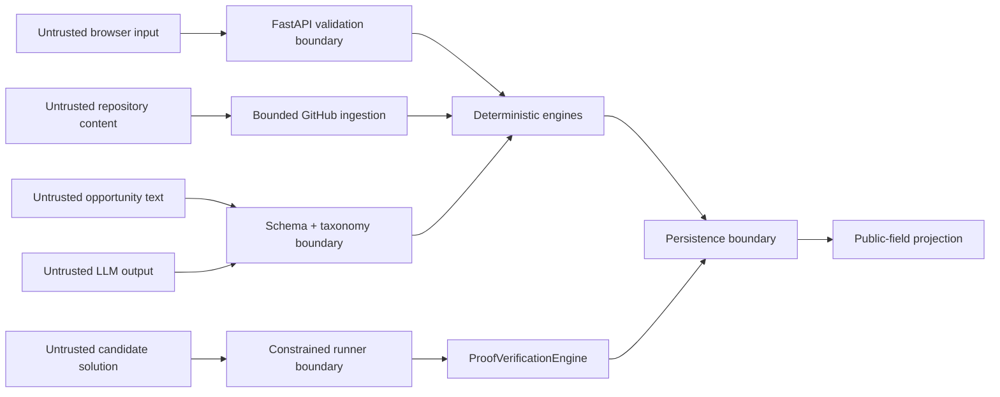

# Security and Trust Boundaries

## Scope

SkillPassport is a hackathon MVP that handles public repository evidence, fictional demo academic records, constrained candidate submissions, authentication-like demo flows, persistent VerificationEvents, and public passport views.

This document defines the security contract the implementation should satisfy and the claims the product may safely make. It is not a claim that the MVP is ready to execute arbitrary hostile code in production.

## Security principles

1. **Minimize authority.** Optional services receive only the information and credentials they require.
2. **Treat external text and code as untrusted.** Repository content, opportunity descriptions, profile fields, and candidate submissions can be malicious.
3. **Keep verification server-authoritative.** The client and LLM cannot grant trust state.
4. **Fail closed for verification.** Timeouts, runtime errors, malformed output, storage failures, or integration failures never promote a claim.
5. **Keep the offline path safe and complete.** Missing credentials must select deterministic fallbacks rather than weaken checks.
6. **Use accurate language.** Evidence and hashes have narrow meanings; do not imply identity, authorship, accreditation, or production isolation.

## Assets to protect

- Gemini and GitHub API credentials
- MongoDB connection strings and stored records
- Password hashes and session material if local authentication is enabled
- Candidate source submissions
- Private repository content obtained with a token
- VerificationEvent integrity and claim state
- Public/private profile boundaries
- Host files, processes, environment, and network reachable by a challenge runner

## Trust boundaries

## Verification authority

The server derives and owns:

- challenge-to-student and challenge-to-claim relationships,
- hidden tests and required pass criteria,
- pass status and tests-passed/tests-total counts,
- demonstrated skill and level,
- timestamps and event identifiers,
- claim promotion, and
- canonical event hash.

The API must reject or ignore client attempts to override those values. A concept check, frontend state change, LLM response, or persisted legacy confidence score cannot create a challenge-verified claim.

A persistence failure after test execution must return a non-verified result until the event and claim transition are durably stored together.

## Challenge execution

Candidate code execution is the system's highest-risk boundary.

### Minimum MVP controls

- Accept narrowly defined function, query, or patch-shaped input rather than arbitrary projects or commands.
- Never interpolate input into a shell command and never enable `shell=True`.
- Execute in a newly created temporary directory.
- Use an explicit executable and fixed arguments.
- Provide a minimal child environment with secrets and unrelated host variables removed.
- Enforce a strict wall-clock timeout.
- Bound stdout, stderr, source length, memory, process creation, and file creation where the platform permits.
- Disable outbound network access where practical.
- Restrict dangerous imports, built-ins, SQL statements, and filesystem access appropriate to the challenge type.
- Use fresh state for each attempt.
- Return curated diagnostics instead of raw stack traces, host paths, or environment details.
- Treat syntax errors, nonzero exits, timeouts, partial passes, and verifier errors as failure.
- Keep hidden tests and verifier implementation on the server.

### Python and FastAPI challenges

Import allow/deny rules and AST checks reduce accidental abuse but are not a complete sandbox. Framework challenges should expose only the minimum interface needed for deterministic tests. Do not pass backend service credentials or the application data store into the child process.

### SQL challenges

Use an isolated, disposable database. Allow only the expected read/query shape. Reject multiple statements and dangerous operations such as attachment, extension loading, schema mutation, filesystem-backed export, or environment-specific pragmas unless the template explicitly and safely requires them.

### Production hardening

A production version should move execution to disposable isolated workers such as locked-down containers, sandboxes, or microVMs with:

- no host filesystem mounts,
- enforced network denial,
- read-only base images,
- CPU, memory, process, disk, and output quotas,
- syscall and capability restrictions,
- per-attempt identities,
- job queues and kill/reap behavior,
- audit logs and anomaly detection, and
- tested escape and denial-of-service defenses.

The MVP must never be called “cheat-proof,” “fraud-proof,” or a production-grade sandbox.

## GitHub integration

### SSRF and download controls

- Accept GitHub repository URLs only; reject lookalike or arbitrary hosts.
- Parse owner, repository, and branch as data, then construct requests against fixed GitHub API endpoints.
- Reject embedded credentials, unexpected ports, traversal, control characters, and ambiguous URL forms.
- Bound API calls, tree size, source-file count, and file bytes.
- Do not recursively clone or download an unbounded repository during an API request.
- Apply connect/read/total timeouts.
- Handle redirects conservatively and do not forward credentials to another host.

### Token and private content

- Keep `GITHUB_TOKEN` on the backend.
- Never include it in frontend JavaScript, URLs, exceptions, analytics, or logs.
- Request the minimum practical token scope.
- Treat private repository evidence as non-public by default.
- Public passport projections must not expose private source content or access URLs without explicit consent.
- On authentication, rate-limit, or network failure, return a clear error and offer the bundled snapshot; never silently fabricate evidence.

## Gemini integration

- Keep `GEMINI_API_KEY` on the backend.
- Send the minimum evidence context needed for interpretation; avoid secrets and private source bodies.
- Require structured output and validate it with Pydantic.
- Normalize proposed skills against the supported taxonomy.
- Reject unsupported challenge types and invalid levels.
- Treat model text as untrusted content when rendering it.
- Apply timeouts and bounded retries.
- Fall back deterministically on missing key, refusal, malformed output, unknown taxonomy entries, or service failure.
- Never allow the model to supply executable shell commands, hidden tests, pass status, or a VerificationEvent.

## Authentication and sessions

The hackathon may use local/demo authentication, but it must not be described as enterprise identity verification.

- Hash passwords with a dedicated password-hashing algorithm and unique salts.
- Never store or log plaintext passwords.
- Return generic authentication failures that do not enumerate accounts.
- Keep session or token secrets out of source control and frontend code.
- Apply secure, `HttpOnly`, and `SameSite` cookie settings when cookie sessions are used; require TLS outside local development.
- Scope records to the authenticated/demo student on the server rather than trusting a client-supplied student ID.
- Rate-limit authentication and expensive analysis/challenge routes before public deployment.
- Make demo/reset behavior explicit and disable or protect destructive reset capabilities outside demo environments.

## API and browser security

- Validate request size, field length, enums, identifiers, and content types with Pydantic and server-side limits.
- Return safe errors; do not expose stack traces, filesystem paths, queries, secrets, or raw subprocess output.
- Serve frontend and API from the same origin where possible. Keep CORS disabled or narrowly scoped when it is not needed.
- Render repository, evidence, profile, opportunity, AI, and public-passport fields as text; avoid unsanitized `innerHTML`.
- Use a Content Security Policy compatible with the final frontend and avoid remote scripts in the offline demo path.
- Prevent open redirects and unsafe URL schemes in evidence links.
- Do not place credentials or sensitive submissions in query strings.
- Add anti-CSRF protection if authenticated state-changing actions rely on cookies.
- Avoid logging full request bodies on auth and challenge-submission routes.

## Persistence

### File store

- Store runtime state outside tracked fixtures.
- Write to a temporary file, flush as appropriate, and atomically replace the live file.
- Restrict filesystem permissions to the application user.
- Validate loaded JSON against current models.
- Fail safely on corruption and preserve a recoverable copy where practical.
- Serialize concurrent writes or use a store-level lock.
- Keep tests isolated with temporary paths.
- Make demo reset deterministic and narrowly scoped to the demo store.

### MongoDB

- Keep `MONGODB_URI` out of source, errors, and logs.
- Use TLS and a least-privilege database user outside local development.
- Enforce unique identifiers and indexes needed for event consistency.
- Validate documents through the same model contracts as the file adapter.
- Treat an unavailable adapter as a configuration/runtime failure; do not silently lose a passed event.

### VerificationEvent integrity

Compute the SHA-256 reference from canonical server-controlled fields using stable ordering and serialization. Do not accept a client-provided hash as authoritative. Recompute it when validating a public record.

An unkeyed hash detects mutation only when compared with a trusted value. It does not prove who issued the event. Stronger future issuance requires signing keys, key rotation, issuer identity, revocation, and verification policy.

## Public passport privacy

- Project only explicitly public fields into the public response.
- Do not expose email, password/session data, private repository bodies, internal attempt diagnostics, or academic details beyond the consented summary.
- Use unguessable passport identifiers where practical and return a normal 404 for unknown IDs.
- Make public issuance or sharing an intentional action.
- Provide revocation/unpublishing and retention controls before production deployment.
- Derive share and QR URLs from the current trusted origin; never accept an arbitrary scriptable URL.

## Secrets management

- Commit `.env.example` placeholders only; never commit `.env`.
- Scan tracked files and reachable Git history before release.
- Redact common credentials and connection strings from logs.
- Rotate a credential immediately if it is exposed; deleting the current file is not sufficient because Git retains history.
- Use deployment secret stores rather than repository or image build arguments in production.

## Security test checklist

Release checks should cover:

- invalid login, duplicate signup, password hash inspection, and response redaction;
- cross-student claim/challenge/passport access attempts;
- client attempts to forge pass status, counts, level, event ID, and hash;
- syntax error, exception, infinite loop, output flood, process spawn, filesystem access, network access, and prohibited imports in challenge input;
- destructive/multi-statement SQL input;
- non-GitHub, credential-bearing, redirected, oversized, private, rate-limited, and timed-out repository requests;
- malformed and hallucinated Gemini output with no-key fallback;
- HTML/script payloads in every external text field;
- corrupted and concurrently written file-store data;
- event persistence and hash recomputation;
- public response field allow-listing;
- secret scans of the tracked tree and reachable history; and
- a full offline Judge Demo with no external credentials.

## Responsible disclosure

Do not include credential values, private repository content, or exploit payloads in a public issue. Contact the repository maintainers through the private channel listed by the hackathon team, include the affected version and reproduction conditions, and allow time for a fix before public disclosure.
