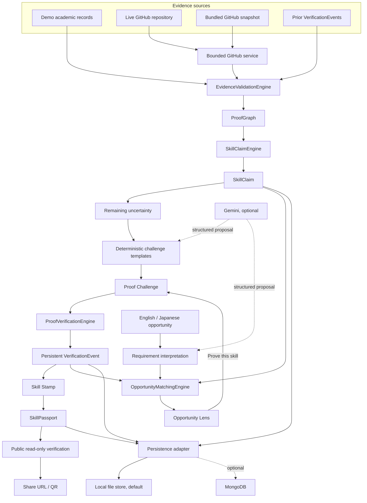
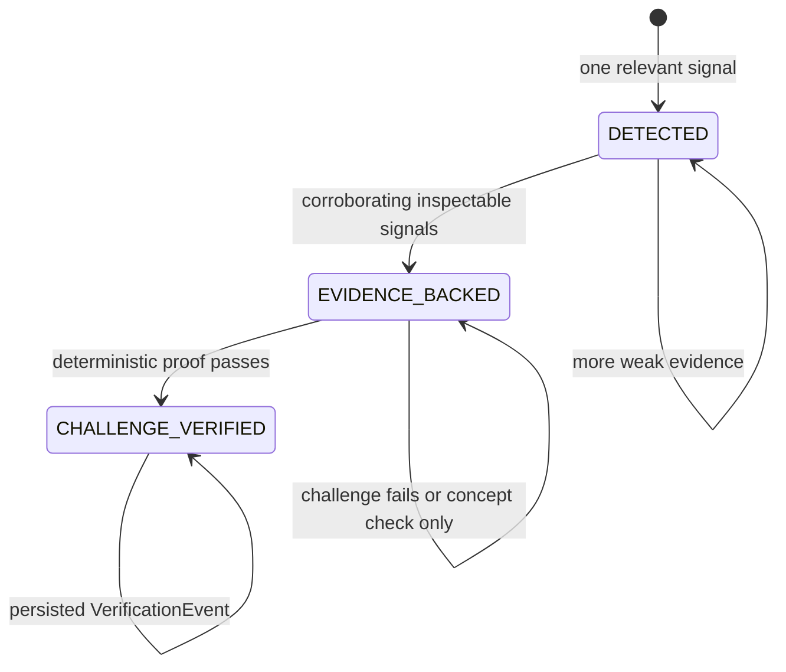
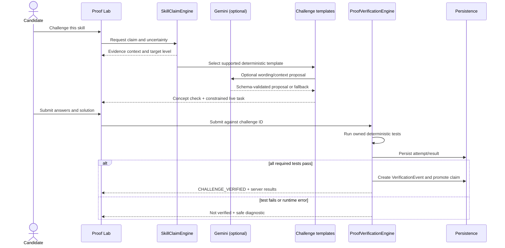

# SkillPassport Architecture

## Purpose

SkillPassport turns inspectable evidence into skill claims, challenges the uncertainty that remains, persists deterministic verification results, and shows what those results unlock.

The architecture is intentionally built around one trust rule:

> **AI proposes. Engines prove.**

An LLM may interpret context or suggest structured language. It is outside the verification authority boundary. Only deterministic evidence rules and challenge execution can affect a claim's verified state.

## System context



## Deployment shape

The hackathon application uses one FastAPI process:

```text
Browser
  │
  ├── static frontend ───────────────┐
  │                                  │
  └── relative /api requests ──> FastAPI
                                     │
                       ┌─────────────┼─────────────┐
                       │             │             │
                    Engines       Services      Persistence
```

FastAPI serves the frontend and API from the same origin. This removes the need for a second development server in the demo, avoids hardcoded hostnames, and makes the documented run path a single Uvicorn command.

The architecture stays modular without introducing microservices. Engine and service boundaries are Python responsibilities, not network boundaries.

## Trust lifecycle



### `DETECTED`

At least one signal suggests the skill exists. A FastAPI dependency without substantive implementation is a typical example. Detection is not verification.

### `EVIDENCE_BACKED`

Multiple independent and inspectable signals support the claim. Relevant source, framework usage, tests, contribution metadata, and coursework may corroborate one another. This state still does not claim execution verification.

### `CHALLENGE_VERIFIED`

The candidate passed a relevant constrained challenge under deterministic verification. Promotion creates a persistent VerificationEvent. No other service, frontend action, concept-check score, or LLM output may create this state.

## Core responsibilities

### EvidenceValidationEngine

Answers: **What objective evidence exists?**

It normalizes bounded GitHub evidence, demo academic evidence, contribution signals, and prior verification events into provenance-rich evidence items. Each item identifies its source type, source reference, relevant skill, summary, directness, and metadata needed for inspection.

Important rules:

- Technology names in legacy metadata are not sufficient proof by themselves.
- Academic evidence is supporting evidence and is labeled when synthetic.
- Contribution attribution is a signal rather than an identity guarantee.
- Missing or unavailable external evidence is reported; it is never invented.

### SkillClaimEngine

Answers: **Which claims are supported, why, and what remains uncertain?**

It groups evidence through the skill taxonomy, builds ProofGraph relationships, assigns an explainable strength label, and determines `DETECTED` or `EVIDENCE_BACKED`. It also identifies whether a supported challenge exists and selects an appropriate foundation, intermediate, or advanced target.

The engine may use internal deterministic weights for ordering and thresholds, but the interface exposes reasons and qualitative labels rather than false scientific precision.

### ProofVerificationEngine

Answers: **Did this candidate pass the selected deterministic challenge?**

The engine owns challenge tests and server-derived results. It validates that the challenge, student, and claim belong together; runs the constrained verifier; records the result; and is the only authority allowed to promote a claim.

The client must not control:

- pass status,
- hidden tests,
- tests-passed or tests-total counts,
- verified skill or level,
- completion time,
- VerificationEvent identifier, or
- integrity hash.

### OpportunityMatchingEngine

Answers: **Which requirements are challenge-verified, evidence-backed, detected, or missing?**

Requirement interpretation and requirement comparison are separate steps. Gemini may propose normalized requirements from Japanese, English, or mixed text. When Gemini is absent or invalid, a deterministic taxonomy matcher extracts known skills. The matching engine then compares normalized requirements with persisted claims and events.

The result is transparent coverage, for example:

```text
Required capabilities:       4
Challenge-verified:          2
Evidence-backed:             1
Detected or missing:         1
```

No opaque AI match percentage controls the result.

## ProofGraph

ProofGraph is a normal persistent model rendered as a graph; it does not require a graph database.

```text
FastAPI — EVIDENCE_BACKED
  ├── dependency: requirements.txt → fastapi
  ├── implementation: backend/api/routes.py → APIRouter
  ├── behavior: route decorators and response models
  ├── tests: API regression tests
  ├── contribution: candidate-attributed relevant commits
  ├── academic: Demo academic evidence — API Development
  └── uncertainty: duplicate-resource error handling
        └── Intermediate FastAPI Proof Challenge
```

Every visible evidence node must retain a source reference and safe inspectable details. Graph edges explain relationships such as `SUPPORTS`, `CORROBORATES`, `ATTRIBUTED_TO`, `LEAVES_GAP`, and `VERIFIED_BY`.

## Proof Challenge flow



The short concept check is supporting context. It never grants verified status on its own.

## VerificationEvent and integrity reference

A successful event records the candidate, claim, challenge, method, demonstrated level, deterministic test result, timestamps, and evidence-integrity reference. A Skill Stamp is a view of this persisted event plus its supporting evidence.

The event hash is computed from a canonical server-side representation. It can reveal accidental or unauthorized mutation when recomputed. It does not prove legal identity, issuer authority, authorship, or third-party accreditation, and it is not a digital signature.

## Persistence

All stateful behavior uses a small persistence abstraction.

### Local file store

The default adapter keeps the application credential-free and offline-capable. It must write atomically, maintain referential relationships, and support reset to the deterministic demo fixture. Tests use isolated temporary stores.

### MongoDB adapter

When `MONGODB_URI` is configured, an optional adapter may persist the same logical models in MongoDB. Failure to configure or reach MongoDB must not make the bundled demo unusable. The two adapters must preserve equivalent trust behavior.

## GitHub evidence integration

The GitHub service accepts a repository URL plus optional username and branch. It constructs GitHub API requests rather than fetching arbitrary user-provided URLs.

The live analyzer is bounded by design:

- validate the GitHub host and repository shape,
- cap API calls and tree traversal,
- cap selected source files and individual file size,
- prioritize manifests, relevant implementation, tests, and recent commits,
- retain file paths and commit provenance,
- use `GITHUB_TOKEN` only on the backend, and
- return safe fallback states for invalid, private, rate-limited, or unavailable repositories.

The bundled snapshot uses the same normalized evidence shape so the downstream engines behave consistently offline.

## Gemini integration

Gemini is useful only where semantic interpretation adds value:

1. describing an evidence gap and personalizing an already supported challenge category; and
2. turning opportunity prose into schema-validated requirements.

Its output is treated as an untrusted proposal. Pydantic validation, taxonomy normalization, supported-template checks, and deterministic fallbacks bound its effect. It cannot author hidden tests or create a VerificationEvent.

## Failure and fallback behavior

| Failure | Required behavior |
|---|---|
| No Gemini key, timeout, or invalid structured output | Use deterministic challenge wording and opportunity extraction. |
| Invalid repository, GitHub outage, or rate limit | Explain the failure and offer/load the bundled snapshot. |
| No MongoDB URI or unavailable MongoDB | Use the local file store for the demo path. |
| Challenge syntax/runtime/timeout failure | Return a safe failed result; never promote the claim. |
| No evidence for a skill | Do not invent a claim. |
| Unsupported proof type | Keep the claim evidence-backed/detected and do not show a fake live-proof action. |
| Opportunity text yields no requirements | Ask for a more descriptive opportunity; do not fabricate coverage. |

## Public verification

The public route is read-only and keyed by a passport identifier. It presents only the candidate display fields selected for publication, issued Skill Stamps, evidence summary, verification dates and IDs, and integrity references.

The share action copies a route derived from the current application origin. The QR represents the same route. A phone cannot resolve a loopback-only development address on another device, so network-hosted demonstrations must use a reachable origin.

## Security boundary

The highest-risk component is candidate code execution. The hackathon verifier must constrain task shape, avoid shell execution, isolate temporary files, remove secrets from the child environment, enforce strict time/output limits, and disable network access where practical. These controls reduce demo risk but do not make an in-process or host subprocess runner a production hostile-code sandbox.

See [SECURITY.md](SECURITY.md) for threats, required controls, and production hardening.

## Architectural non-goals

- No graph database solely for the visualization
- No microservices for the hackathon MVP
- No blockchain or NFT credential layer
- No webcam surveillance or proctoring
- No generic chatbot
- No opaque ML verification score
- No LLM-controlled pass/fail decision
- No claim of live university integration for bundled demo records
